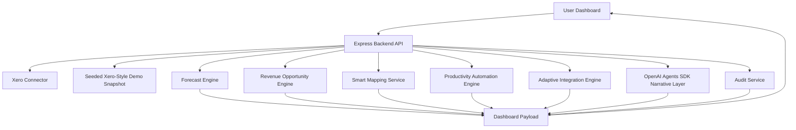

# CashPilot App Deep Dive

This document explains what every major part of CashPilot does, why it exists, how data moves through the app, and how to talk about it in a hackathon judging context. It is intentionally more detailed than the presentation PDF. The deck is for a 3-minute story; this document is for understanding and defending the product.

## 1. Product Summary

CashPilot is an AI revenue and cash-flow action cockpit for small businesses using Xero.

The product answers one operating question:

```text
What should I do today to grow revenue and avoid a future cash crunch?
```

Most accounting dashboards show the owner what already happened. CashPilot turns accounting records into a forward-looking action plan:

- It reads Xero contacts, invoices, bills, payments, bank transactions, repeating invoices, items, accounts, tracking categories, and reports.
- It forecasts the next 30-90 days of cash.
- It predicts when cash may fall below a safe threshold.
- It detects revenue opportunities such as closed-won deals that were never invoiced, dormant customers, upsells, retainer conversions, late-payment recovery, and underperforming services.
- It handles messy external records from CRM, e-commerce, payments, SaaS, payroll, and spreadsheets.
- It queues human-approved actions such as invoice follow-ups, early-payment incentives, draft invoices, supplier timing requests, reconciliation prep, and integration sync drafts.
- It records audit events that keep Xero and external source IDs attached to every recommendation.

The key principle is:

```text
Deterministic code calculates numbers. Agents explain, rank, plan, and draft actions.
```

That matters because an LLM should not invent financial forecasts. The app uses code for forecasts, sensitivity tests, Monte Carlo simulation, matching, scoring, and ranking. The agent layer consumes those structured outputs and turns them into plain-English decisions and messages.

## 2. The Real User Pain

The target user is a small business owner or operator who uses Xero but does not have a finance team constantly watching cash and revenue leakage.

The painful real-world problems are:

1. Cash can become dangerous before the owner notices.
   An overdue invoice alone is not the problem. The problem is an overdue invoice colliding with rent, payroll, supplier bills, and recurring software costs.

2. Owners need the highest-impact action, not a list of overdue items.
   The app should answer: should I chase this customer, offer a discount, delay a supplier payment, or focus on a missing invoice?

3. Revenue leaks happen between tools.
   A CRM says a deal is closed-won, but Xero has no invoice. An e-commerce order has missing tax data. A payment processor payout needs gross revenue and fees split correctly.

4. Integrations break because business data is messy.
   Company names do not match exactly. Invoice numbers lose hyphens. Spreadsheet rows lack supplier IDs. Vendors use aliases.

5. Automation must be safe.
   A small business cannot let an agent silently send customer emails, delay critical suppliers, or create accounting records without review.

CashPilot is designed around these pains. The workflow is not "AI gives advice"; it is "Xero-backed evidence plus forecast impact plus owner approval."

## 3. High-Level Architecture



The app is currently a React/Vite frontend with an Express/TypeScript backend.

Important files:

| Area | File | What it does |
| --- | --- | --- |
| Frontend dashboard | `src/App.tsx` | Renders the whole CashPilot cockpit, handles source switching, approval selection, chart horizon, and approval submission. |
| Forecast fan chart | `src/components/ForecastRiskScene.tsx` | Renders the cash risk fan chart, weekly risk calendar, decision readout, and top driver impact bars. |
| Styling | `src/styles.css` | Defines the dark operational dashboard UI, panels, cards, charts, approval states, and responsive behavior. |
| Backend routes | `src/server/index.ts` | Serves health, dashboard payload, Xero OAuth, Xero status, audit log, and approval queue endpoints. |
| Payload builder | `src/server/dashboard.ts` | Orchestrates all model engines and returns one `DashboardPayload` to the frontend. |
| Xero connector | `src/integrations/xero.ts` | Handles OAuth, token storage, Xero SDK calls, raw Xero-to-domain mapping, demo auth mode, endpoint/scopes provenance. |
| Xero MCP bridge | `src/integrations/xeroMcp.ts` | Inspects optional Xero MCP server configuration and surfaces MCP/tooling status. |
| Forecast engine | `src/forecast/forecastEngine.ts` | Performs data quality checks, cash-flow ledger forecasting, Monte Carlo risk, action ranking, and explainability. |
| Revenue engine | `src/revenue/opportunityEngine.ts` | Detects growth opportunities using Xero invoices, contacts, line items, and external mapped records. |
| Mapping service | `src/mapping/smartMappingService.ts` | Fuzzy-matches messy external records to Xero contacts with confidence and evidence. |
| Productivity engine | `src/productivity/automationEngine.ts` | Creates workflow automation candidates for receipts, reconciliation, duplicate bills, contractors, and subscriptions. |
| Adaptive integrations | `src/integrations/adaptive/adaptiveIntegrationEngine.ts` | Maps messy CRM/e-commerce/payments/spreadsheet/SaaS records into Xero object candidates. |
| Agent layer | `src/agents/cfoNarrativeAgent.ts` | Runs specialist OpenAI Agents when configured, otherwise the app uses deterministic fallback narrative. |
| Audit service | `src/audit/auditService.ts` | Maintains seed and approval audit events with source record IDs. |
| Demo data | `src/data/demoSnapshot.ts` | Seeded Xero-style company data for Northstar Design Studio. |
| External mock data | `src/connectors/mockExternalSales.ts` | CRM and e-commerce-like external records used by mapping and revenue leak detection. |
| Tests | `tests/runTests.ts` | Validates core forecast, revenue, mapping, productivity, integration, audit, and Xero provenance behavior. |

## 4. The Central Data Contract

The whole UI is powered by one object: `DashboardPayload` in `src/types/domain.ts`.

The backend builds this payload in `src/server/dashboard.ts`. The frontend fetches it from:

```text
GET /api/dashboard?source=demo
GET /api/dashboard?source=xero
```

The payload includes:

- `source`: whether the data came from seeded demo data or the Xero API path.
- `generatedAt`: timestamp for the dashboard run.
- `snapshot`: organisation name, currency, as-of date, opening cash, and safe cash threshold.
- `dataQuality`: data readiness score and issues.
- `baseline`: before-action cash forecast scenario.
- `afterActions`: after-action cash forecast scenario.
- `forecastIntelligence`: model cards and cash driver explanations.
- `recommendedActions`: cash-flow actions such as chasing invoices, early-payment incentive, supplier timing.
- `revenueGrowth`: summary of detected revenue upside.
- `revenueOpportunities`: individual growth actions.
- `smartMappingSummary`: summary of fuzzy external-to-Xero matching.
- `entityMatches`: detailed mapping candidates.
- `productivitySummary`: summary of productivity automations.
- `productivityTasks`: individual automation tasks.
- `integrationSummary`: summary of adaptive integration candidates.
- `integrationCandidates`: integration sync candidates from external tools into Xero.
- `auditLog`: traceability events.
- `ownerPriorities`: plain-language business priorities.
- `narrative`: CFO-style explanation.
- `xero`: endpoint, scope, record count, SDK, MCP, and tooling provenance.
- `agentLayer`: status of specialist agents and whether OpenAI Agents SDK ran.

This contract is why the frontend stays simple. It does not calculate finance results. It displays the structured decision packet returned by the backend.

## 5. Backend API Routes

All backend routes are in `src/server/index.ts`.

### `GET /api/health`

Returns a basic health response:

- `ok`
- service name
- timestamp

Purpose: simple local/server sanity check.

### `GET /api/integrations/xero/status`

Returns whether Xero is configured and authenticated.

It reports:

- whether required env vars exist
- whether stored OAuth tokens exist
- required scopes
- token path
- tenant name/id if connected
- connect URL

The sidebar uses this to display:

- Connected
- OAuth ready
- Config needed

### `GET /auth/xero/start`

Starts Xero OAuth.

If `XERO_DEMO_AUTH=true`, this redirects straight back to the app in demo-Xero mode. This was added because the hackathon demo may not have live Xero login available.

If real Xero credentials exist, this builds a Xero consent URL using `xero-node`.

### `GET /auth/xero/callback`

Completes OAuth:

- receives Xero callback URL
- exchanges code for tokens
- selects tenant
- stores token/tenant metadata locally
- sends the user back to `http://127.0.0.1:5173/?source=xero`

### `GET /api/dashboard`

Builds the full app payload.

If `source=xero`:

- tries `loadXeroSnapshotFromApi()`
- if live Xero fails and `XERO_USE_DEMO_ON_API_FAILURE` is not false, falls back to seeded demo data
- updates the Xero note to explain the fallback

If `source=demo`:

- uses the seeded Xero-style snapshot

Then `buildDashboardPayload()` orchestrates every model and returns the full payload.

### `GET /api/audit-log`

Returns the current in-memory audit log.

### `POST /api/actions/approve`

Receives selected IDs:

- cash action IDs
- revenue opportunity IDs
- productivity task IDs
- integration candidate IDs
- source mode

It records approval audit events and returns:

- approval timestamp
- status: `queued-for-human-reviewed-execution`
- counts by action type
- created audit log entries
- note describing reviewed Xero execution

Important: this does not call Xero write endpoints. It simulates the safe approval queue and logs what would be executed after human review.

## 6. Xero Integration

The Xero connector lives in `src/integrations/xero.ts`.

### Why Xero Is Central

Xero is treated as the system of record. External tools may propose signals, but CashPilot validates them against Xero before recommending action.

Examples:

- A CRM deal only becomes a revenue leak if there is no matching Xero invoice.
- A customer follow-up uses Xero invoice number, due date, amount, and contact behavior.
- A supplier delay request uses Xero bill date, amount, supplier sensitivity, and planned payment date.
- Forecasting depends on Xero receivables, payables, payment history, bank summary, and recurring flows.
- Audit events preserve Xero contact IDs, invoice IDs, bill IDs, and external source IDs together.

### OAuth Scopes

The app declares these identity scopes:

```text
openid
profile
email
offline_access
```

It declares granular accounting scopes:

```text
accounting.invoices
accounting.invoices.read
accounting.payments.read
accounting.banktransactions.read
accounting.reports.aged.read
accounting.reports.balancesheet.read
accounting.reports.profitandloss.read
accounting.reports.trialbalance.read
accounting.contacts
accounting.contacts.read
accounting.settings
accounting.settings.read
```

It also includes compatibility scope:

```text
accounting.reports.read
```

Reason: the Bank Summary report path still needs broad report compatibility in the current SDK surface.

### Xero Endpoints Represented

The app shows and/or uses these Xero surfaces:

```text
GET /connections
GET /Organisations
GET /Contacts?summaryOnly=true
GET /Invoices?Statuses=AUTHORISED,PAID
GET /Accounts
GET /Items
GET /Payments
GET /Quotes
GET /BankTransactions
GET /RepeatingInvoices
GET /TrackingCategories
GET /Reports/BankSummary
GET /Reports/ProfitAndLoss
GET /Reports/BalanceSheet
GET /Reports/TrialBalance
GET /Reports/AgedReceivablesByContact
GET /Reports/AgedPayablesByContact
```

### Live Xero Snapshot Flow

When live Xero is connected:

1. `getAuthorizedXeroSession()` reads stored token state.
2. If the token is close to expiry, it refreshes the token.
3. It selects the active tenant.
4. It requests core resources:
   - organisations
   - contacts
   - authorised invoices
   - paid invoices
   - bank summary report
5. It requests optional enrichment resources with `Promise.allSettled()`:
   - accounts
   - items
   - payments
   - quotes
   - bank transactions
   - repeating invoices
   - tracking categories
   - profit and loss
   - balance sheet
   - trial balance
6. It requests aged receivable/payable reports for the first few contacts.
7. It maps raw Xero responses into the app's domain model.
8. It returns both:
   - `snapshot`: normalised forecast-ready accounting data
   - `provenance`: endpoints, scopes, counts, tooling status, and notes

### Mapping Raw Xero Into CashPilot Types

Contacts are mapped into:

- `id`
- `name`
- `kind`: customer, supplier, or both
- `email`
- `medianDaysLate`
- `paymentReliability`
- `relationshipSensitivity`
- notes

Payment reliability is inferred from paid invoices:

```text
reliability = clamp(1 - medianDaysLate / 45, 0.35, 0.95)
```

Invoices are mapped into:

- receivable or payable type
- invoice/bill number
- contact ID
- issue date
- due date
- amount due
- total
- paid date
- line items

Line item categories are inferred from description/account code:

- Website
- Content
- Strategy
- Conversion
- Analytics
- Retainer
- General

The bank summary report is parsed to extract a closing cash figure for opening cash.

### Demo Xero Mode

When `XERO_DEMO_AUTH=true`, the app behaves like a connected Xero demo company but uses `demoSnapshot`.

This mode exists for hackathon reliability:

- no live login dependency
- no paid account dependency
- still uses the same app data contract
- still shows Xero endpoint and scope footprint
- still labels the provenance as demo/local mode

## 7. Xero MCP And Agent Toolkit Positioning

The app includes an optional Xero MCP bridge in `src/integrations/xeroMcp.ts`.

The goal is to show readiness for Xero's newer agent tooling without making the demo depend on a fragile local MCP process.

The Xero tooling provenance shown in the UI includes:

- official `xero-node` SDK
- `@xeroapi/xero-mcp-server` package name
- MCP enabled or ready status
- MCP auth mode
- tool examples
- Xero Agent Toolkit pattern
- prompt-library guidance
- safe-write mode

The agent-toolkit pattern is described as:

```text
OpenAI Agents SDK + MCPServerStdio pattern from XeroAPI/xero-agent-toolkit
```

For the hackathon, this matters because Xero use is not just a logo or a connect button. The app has:

- OAuth path
- SDK path
- endpoint footprint
- scope list
- data mapping
- MCP/tooling readiness
- agent orchestration
- safe-write approval design

## 8. Forecast Engine

The forecast engine is in `src/forecast/forecastEngine.ts`.

It contains the core numerical logic.

### 8.1 Data Quality Agent Logic

`assessDataQuality(snapshot)` checks whether the Xero data is forecast-ready.

It looks for:

- missing or non-positive opening cash
- open invoices without contact records
- open invoices without due dates
- limited paid-invoice history

It starts at 100 and subtracts penalties:

- critical issue: 38 points
- warning: 16 points
- info: 6 points

It returns:

- `score`
- `status`
- issue list

Status thresholds:

- `forecast-ready`: score >= 80
- `usable-with-caveats`: score >= 55
- `needs-cleanup`: score < 55

Why it matters: an AI finance tool must know when the source data is too weak to trust.

### 8.2 Daily Cash Ledger Forecast

`buildForecastScenario(snapshot, name, options)` builds the baseline or after-action scenario.

It does four things:

1. Builds dated payment events.
2. Builds a daily cash ledger.
3. Summarises first breach and minimum cash.
4. Runs Monte Carlo to estimate crunch probability.

The daily ledger is deterministic. For each day:

```text
closing balance =
  opening balance
  + customer inflows
  + recurring inflows
  - supplier outflows
  - recurring outflows
```

The resulting `ForecastPoint` includes:

- date
- opening balance
- customer inflows
- supplier outflows
- recurring inflows
- recurring outflows
- closing balance

### 8.3 Expected Payment Dates

Receivable timing is not just invoice due date. It uses:

- invoice expected payment date if present
- otherwise due date plus contact median days late
- if that date is already in the past, it moves it forward based on reliability

This is the payment-delay model.

Example:

```text
expectedReceivableDate = invoice due date + contact median days late
```

This lets the forecast model reality: customers do not always pay on the due date.

### 8.4 Before vs After Actions

Baseline forecast uses existing Xero timing.

After-action forecast applies selected actions:

- invoice chase can pull cash earlier
- early-payment discount can pull a large future invoice into the risk window
- supplier delay can push an outflow out of the risk window

The app then compares:

- first threshold breach date
- minimum cash balance
- crunch probability
- protected cash

### 8.5 Cash Action Recommendations

`recommendCashActions(snapshot, baseline)` creates and ranks cash-flow actions.

It creates receivable actions:

- `chase_invoice`
- `early_payment_incentive`

It creates payable actions:

- `delay_supplier_payment`

The engine checks:

- expected payment date
- breach date
- invoice amount
- customer reliability
- supplier relationship sensitivity
- whether the action improves cash before the crunch

It then returns one top action per action type, sorted by impact.

The output action includes:

- title
- contact
- invoice/bill
- amount
- expected cash date
- impact before crunch
- confidence
- relationship risk
- rationale
- message draft
- approval plan

### 8.6 Monte Carlo Simulation

`runMonteCarlo(snapshot, actions, { horizonDays, runs })` estimates crunch probability.

Current default:

```text
420 simulation runs
```

For each run:

1. It varies authorised receivable payment dates.
2. It uses contact payment reliability and median days late.
3. It applies random delay variance using a seeded pseudo-random generator.
4. It rebuilds the forecast scenario.
5. It records whether cash falls below the safe threshold.

Crunch probability is:

```text
runs with a threshold breach / total runs
```

For a non-technical audience:

```text
We simulate many realistic futures where customers pay a bit earlier or later.
If 72 out of 100 futures fall below the safe cash line, we show 72% crunch probability.
```

### 8.7 Forecast Explainability

`buildForecastIntelligence()` explains what is moving cash.

It produces four model cards:

1. Daily cash ledger forecast
   - Projects daily opening and closing cash.
   - Inputs: bank summary, authorised invoices, bills, repeating cash flows.

2. Customer payment-delay model
   - Estimates when receivables actually arrive.
   - Inputs: contacts, paid invoices, due dates, fully paid dates.

3. Monte Carlo cash simulation
   - Estimates probability of threshold breach.
   - Inputs: receivables, reliability, supplier bills, recurring flows.

4. Cash-driver attribution
   - Explains which business factors move the forecast most.
   - Inputs: invoice concentration, payable timing, recurring costs, action impact.

It also produces ranked cash drivers:

- customer payment timing
- supplier payment timing
- fixed cost load
- approved action lift
- revenue opportunity pipeline
- starting cash buffer

Each driver includes:

- impact amount
- direction: positive, negative, or risk
- explanation
- evidence chips
- sensitivity note
- confidence

This is the part that turns a chart into a decision tool.

### 8.8 Forecast Fan Chart

The current visual is in `src/components/ForecastRiskScene.tsx`.

It replaced the earlier 3D chart because the 3D view looked cool but was harder to explain.

The fan chart shows:

- pink line: before actions
- teal line: after actions
- amber dashed line: safe cash threshold
- shaded band: payment timing simulation range
- point marker: first risk date
- weekly cards: minimum cash by week and whether actions protect it
- decision readout: breach date, crunch probability, after-action probability, minimum cash lift
- top three driver bars: revenue pipeline, approved action lift, supplier timing

Why this is better:

- dates are on the x-axis
- cash is on the y-axis
- the threshold is visible
- the risk week is called out
- it connects directly to actions and business drivers

## 9. Revenue Opportunity Engine

The revenue engine is in `src/revenue/opportunityEngine.ts`.

It uses Xero invoices, line items, contacts, payment history, and smart-mapped external records.

It returns the top 5 opportunities, ranked by:

```text
(expected revenue + expected cash-flow impact * 0.7)
* urgency boost
* confidence boost
```

### 9.1 Closed-Won Not Invoiced

This is the most important growth use case.

The engine reads external CRM deals from `mockExternalSalesSnapshot`.

For each closed-won deal:

1. Find smart mapping match.
2. Require a good Xero contact match.
3. Search Xero invoices for same contact, similar amount, and close date window.
4. If no matching invoice exists, create a revenue-leak opportunity.

Example:

```text
CRM-DEAL-6500 says Brightside Studio Ltd bought a GBP 6,500 conversion sprint.
Smart mapping links it to Xero contact Brightside Studios.
No matching Xero invoice exists.
CashPilot recommends creating a draft Xero invoice.
```

### 9.2 Dormant Customer Reactivation

The engine groups paid invoices by customer.

It looks for customers with:

- lifetime revenue above a threshold
- no recent paid invoice
- non-supplier contact type

It recommends personalised reactivation based on their prior work.

Pain addressed: good customers quietly stop buying.

### 9.3 Subscription Conversion

The engine looks for repeated purchases in the same line-item category.

If a customer bought the same kind of work multiple times recently, it suggests:

```text
Convert ad-hoc work into a retainer / repeating invoice.
```

Pain addressed: irregular project work could become predictable recurring revenue.

### 9.4 Upsell And Cross-Sell

The engine detects adjacent service gaps.

Examples:

- bought Website but not Conversion
- bought Strategy but not Content
- bought Conversion but not Analytics

It recommends a next-best offer tied to actual invoice line-item history.

Pain addressed: owners often do not mine Xero line items for upsell signals.

### 9.5 Late-Payment Recovery

The engine finds authorised invoices that are overdue or predicted late.

It uses:

- due date
- amount due
- contact median days late
- payment reliability

It recommends payment-date confirmation or follow-up.

Pain addressed: booked revenue is not useful if cash arrives too late.

### 9.6 Underperforming Service Fix

The engine totals revenue by service category.

If a category is materially below portfolio average, it suggests:

- repackage
- bundle
- test with recent buyers
- possibly create a new Xero item or quote bundle

Pain addressed: small businesses often do not know which services are dragging revenue mix.

## 10. Smart Mapping Service

The smart mapping service is in `src/mapping/smartMappingService.ts`.

Its job is to match messy external records to Xero contacts.

### Normalisation

Company names are normalised by:

- lowercasing
- replacing `&` with `and`
- removing punctuation
- splitting into tokens
- removing legal suffixes like `ltd`, `limited`, `llc`, `inc`, `co`, `company`, `plc`

Example:

```text
Brightside Studio Ltd -> brightside studio
Brightside Studios -> brightside studios
```

### Similarity

The matcher combines:

- exact normalised match
- containment match
- token overlap / Jaccard similarity
- Levenshtein edit ratio
- email domain evidence

Confidence formula uses:

- name score
- email domain score
- boost for very high name score
- max cap of 0.98

### Match Status

If confidence is too low:

```text
NEEDS_NEW_CONTACT
```

Otherwise:

```text
PENDING_REVIEW
```

Even high confidence matches remain reviewed, because syncing external records to accounting data is sensitive.

### Evidence

Each match explains why it exists:

- names are highly similar
- names partially match
- email domain matches
- previous Xero relationship context exists
- weak match requires manual review

This is the "Vibe Integrator" heart: adaptive matching with evidence, not brittle exact matching.

## 11. Productivity Automation Engine

The productivity engine is in `src/productivity/automationEngine.ts`.

It addresses Bounty 01: Small Business Productivity Powerhouse.

It simulates messy finance-admin records and converts them into Xero-centered automation tasks.

### 11.1 Receipt To Expense And Bill Match

Input:

```text
Scanned receipt - Print Co. Ltd
```

Xero target:

```text
Bill BILL-188
```

What it does:

- extracts vendor, amount, due date, and reference
- fuzzy-matches vendor to Xero supplier
- matches amount/reference to authorised bill
- suggests expense coding
- queues receipt attachment and bill-coding update

User pain: bookkeepers manually match receipts to bills and account codes.

### 11.2 Smart Payment Reconciliation

Input:

```text
BACS RECEIPT ACME RETAIL GRP INV4012 THANKS
```

Xero target:

```text
Invoice INV-4012
```

What it does:

- normalises bank memo text
- recovers invoice reference without hyphen
- matches payer, amount, invoice number
- queues payment-to-invoice reconciliation
- refreshes forecast after approval

User pain: bank feed descriptions rarely match invoice records perfectly.

### 11.3 Duplicate Supplier Bill Guard

Input:

```text
Forwarded supplier bill - Cloud Lane
```

Xero target:

```text
Bill BILL-733
```

What it does:

- checks alias, amount, period, due date
- flags likely duplicate instead of creating a second bill
- suggests hold note
- escalates because supplier is high sensitivity

User pain: duplicate bills create accidental double payments.

### 11.4 Contractor Payment Prep

Input:

```text
July contractors spreadsheet
```

Xero target:

```text
Bill BILL-077
```

What it does:

- extracts contractor categories and totals
- matches total to Xero bill
- flags cash-flow risk before payment date
- prepares approval checklist

User pain: contractor/payroll payments are high trust and cannot be delayed blindly.

### 11.5 Subscription Expense Control

Input:

```text
Multi-vendor subscription receipt
```

Xero target:

```text
Recurring Software subscriptions
```

What it does:

- classifies SaaS bundle as operating software
- maps to recurring cash-flow category
- suggests coding and tracking category
- monitors unusual increases

User pain: subscription spend becomes messy and inconsistently coded.

## 12. Adaptive Integration Engine

The adaptive integration engine is in `src/integrations/adaptive/adaptiveIntegrationEngine.ts`.

It addresses Bounty 02: Vibe Integrator.

Its job is to act like a universal translator between messy business tools and Xero.

It creates candidates from:

- CRM
- e-commerce
- payments
- spreadsheets
- SaaS renewal systems

Each candidate contains:

- source system
- source record ID
- raw signal
- mapped Xero object
- target Xero record
- confidence score
- expected value
- sync action
- field mappings
- missing fields
- resilience notes
- approval plan

### 12.1 CRM Deal To Xero Draft Invoice

Source:

```text
CRM-DEAL-6500
Brightside Studio Ltd / Conversion sprint / closed-won / 6.5k
```

Target:

```text
Xero Invoice for Contact Brightside Studios
```

Key intelligence:

- understands `6.5k` as GBP 6,500
- maps closed-won to draft invoice, not authorised invoice
- handles legal suffix/pluralisation mismatch

### 12.2 Shopify-Style Order To Xero Sales Invoice

Source:

```text
SHOPIFY-ORDER-1098
Harbor Coffee Co ordered Launch Kit + Brand Assets
```

Target:

```text
Xero sales invoice
```

Key intelligence:

- maps product bundle to line items
- detects missing VAT/tax treatment
- routes missing field to review

### 12.3 Stripe Payout To Invoice And Fee Mapping

Source:

```text
STRIPE-PO-2026-07-02
gross 1,967.00 / fee 54.42 / net 1,912.58
```

Target:

```text
Xero Payment / Bank Transaction / Bank Fee
```

Key intelligence:

- separates gross revenue from payment processor fee
- maps fee to bank fees expense
- prepares reconciliation split

### 12.4 Contractor Sheet To Xero Supplier Bill

Source:

```text
GOOGLE-SHEET-TAB-JULY-CONTRACTORS
```

Target:

```text
Bill BILL-077
```

Key intelligence:

- handles spreadsheet rows without rigid columns
- maps line items to bill allocations
- routes missing supplier IDs to review

### 12.5 SaaS Renewal To Repeating Invoice

Source:

```text
RETENTION-APP-RENEWAL-221
```

Target:

```text
Xero RepeatingInvoice
```

Key intelligence:

- understands monthly cadence
- maps alias `Bright+Ops`
- prepares draft repeating invoice template
- requires billing contact confirmation

## 13. Agent Layer

The agent layer is in `src/agents/cfoNarrativeAgent.ts`.

It uses the OpenAI Agents SDK when `OPENAI_API_KEY` is set. If not, the app uses deterministic fallback narrative, while still showing the specialist agent architecture.

### Specialist Agents

The defined agents are:

- Data Quality Agent
- Forecast Agent
- Cash Action Agent
- Revenue Growth Agent
- Collections and Supplier Communication Agent
- CFO Narrative Agent

The dashboard also shows additional specialist roles in the agent layer status:

- Productivity Automation Agent
- Adaptive Integration Agent
- Supplier Payment Agent
- Outreach Agent

### Important Safety Instruction

Every agent shares this principle:

```text
Never recalculate forecast numbers. Treat all numerical inputs as deterministic application outputs.
```

This is critical. The agent can explain:

- why the forecast matters
- which action is highest impact
- how to phrase a customer message
- where human review is needed

The agent must not invent:

- cash balance
- crunch probability
- expected revenue
- Xero record evidence

### Agent Flow

When agents run:

1. The backend creates compact structured input.
2. Specialist agents run in parallel:
   - data quality
   - forecast
   - actions
   - revenue
   - communication
3. Outputs are validated with Zod schemas.
4. The CFO Narrative Agent creates the final owner-facing summary.
5. If any agent call fails, the deterministic fallback narrative is used.

This makes the demo robust while preserving a real agentic architecture.

## 14. Audit And Approval Model

The audit service is in `src/audit/auditService.ts`.

CashPilot is intentionally human-in-the-loop.

### Approval Queue

The user can select or deselect:

- cash-flow actions
- revenue growth actions
- productivity automations
- integration sync candidates

Clicking approve sends the selected IDs to:

```text
POST /api/actions/approve
```

The backend records audit entries for each approved item.

### Audit Events

Seed events include:

- `SMART_MAPPING_REVIEWED`
- `FORECAST_RUN_CREATED`

Approval events include:

- `CASH_ACTION_APPROVED`
- `REVENUE_RECOMMENDATION_APPROVED`
- `PRODUCTIVITY_AUTOMATION_APPROVED`
- `ADAPTIVE_INTEGRATION_APPROVED`

Each audit entry includes:

- audit ID
- event type
- source record IDs
- payload
- timestamp

### Why This Matters

For a small business, trust is not optional.

The app should be able to answer:

- Which Xero invoice caused this recommendation?
- Which CRM deal or Shopify order created this action?
- What did the owner approve?
- Did we send anything automatically?
- What will be written to Xero after review?

Current answer:

```text
No customer communication or Xero writeback happens automatically.
Approved items are queued for reviewed execution.
```

## 15. Frontend Walkthrough

The frontend lives mainly in `src/App.tsx`.

### 15.1 Side Rail

The side rail contains:

- CashPilot brand
- source selector: demo snapshot or live Xero API
- Xero connection state
- Connect Xero button or credentials warning
- agent specialist status list

Why it exists:

- makes Xero central
- shows whether the demo is seeded or live
- proves the app is built for real OAuth, not only mock data

### 15.2 Command Bar

The command bar contains:

- product title
- organisation context
- live/demo status pills
- agent mode
- selected forecast horizon
- Refresh button
- Approve selected actions button

Why it exists:

- gives the owner one operating command center
- makes approval the main workflow

### 15.3 Signal Band

Top metrics:

- baseline breach
- after-actions result
- revenue upside
- protected cash
- growth actions
- data quality

Why it exists:

- answers the business outcome before details
- shows before/after impact immediately

### 15.4 Pending Approval Panel

Groups selected actions into:

- cash-flow actions
- revenue growth actions
- productivity automations
- adaptive integrations

Each item shows:

- selected checkbox
- title
- amount/impact
- rationale
- Xero records
- approved execution
- human control

Why it exists:

- the app is proactive but not reckless
- judges can see exactly what requires approval

### 15.5 Smart Mapping Review

Shows external records matched to Xero contacts.

Each card shows:

- external name
- source system
- record type
- amount
- confidence
- mapped Xero contact
- evidence
- approve/reject/new contact actions

Why it exists:

- demonstrates adaptive integration
- solves messy company-name matching

### 15.6 Owner Priorities

Plain-English business priorities.

Examples:

- avoid the cash squeeze
- prevent late-payment stress
- close revenue leakage
- improve predictable revenue
- protect supplier trust

Why it exists:

- gives non-technical owners a practical todo list
- translates model output into business outcomes

### 15.7 Productivity Powerhouse Panel

Shows workflow automations:

- receipt to expense
- smart reconciliation
- duplicate bill guard
- contractor payment prep
- subscription expense control

Each card shows:

- confidence
- workflow
- Xero target
- messy signals
- automation steps
- time saved
- recommended action

Why it exists:

- supports Bounty 01
- shows real finance-admin time savings

### 15.8 Adaptive Integration Hub

Shows integration candidates:

- CRM deal to invoice
- e-commerce order to invoice
- payment payout to reconciliation
- spreadsheet to bill
- SaaS renewal to repeating invoice

Each card shows:

- source system
- raw signal
- mapped Xero object
- target record
- confidence
- field mappings
- missing fields
- resilience notes

Why it exists:

- supports Bounty 02
- proves the app can handle messy/incomplete data

### 15.9 Before vs After Chart

This is the Recharts line chart.

It shows:

- before actions line
- after actions line
- safe threshold reference line
- risk reference area
- 30/60/90 day horizon selector

Why it exists:

- quick before/after forecast comparison
- easy first visual for judging

### 15.10 CFO Narrative

Shows:

- summary
- board-level narrative
- assumptions

If OpenAI Agents SDK is configured, this comes from agents. Otherwise it comes from deterministic fallback text.

Why it exists:

- a small business owner needs an explanation, not only a chart

### 15.11 Forecast Intelligence

This is the deeper explainability section.

It includes:

- cash risk fan chart
- weekly risk calendar
- decision readout
- top driver bars
- model cards
- cash driver cards

Why it exists:

- explains why cash changes
- shows uncertainty
- connects actions to forecast impact
- makes the model defensible

### 15.12 Xero API Footprint

Shows:

- endpoint list
- invoice/contact/report counts
- whether data is live or demo

Why it exists:

- Xero is 50% of the judging criteria
- judges need to see Xero usage clearly

### 15.13 Xero Resource Depth

Shows:

- Accounting API coverage
- record counts
- MCP/tool examples
- Agent Toolkit pattern
- scopes
- prompt-library guidance
- safe write mode

Why it exists:

- demonstrates strong use of Xero developer resources
- shows readiness for live production integration

### 15.14 Revenue Opportunity Agent

Shows the top revenue opportunities.

Each card includes:

- opportunity type
- expected revenue
- expected cash-flow impact
- confidence
- urgency
- model signals
- evidence
- message draft
- approval plan

Why it exists:

- directly addresses revenue growth track

### 15.15 Action Simulator

Shows ranked cash actions.

Each action includes:

- selected checkbox
- type
- invoice/bill
- contact
- amount
- expected cash date
- cash protected before crunch
- confidence
- relationship risk
- rationale
- approval plan

Why it exists:

- shows which action changes the forecast most

### 15.16 Human Approval Queue Messages

Shows agent-drafted messages for:

- revenue growth opportunities
- invoice follow-ups
- supplier timing requests

Why it exists:

- turns insights into action
- keeps human approval before sending

### 15.17 Audit Log

Shows traceability events.

Each event includes:

- event type
- timestamp
- source IDs
- status transition

Why it exists:

- builds trust
- demonstrates safe automation

## 16. Demo Data Story

The seeded company is:

```text
Northstar Design Studio
```

As of:

```text
2026-07-04
```

Opening cash:

```text
GBP 12,600
```

Safe threshold:

```text
GBP 5,000
```

Important Xero-style contacts:

- Acme Retail Group: customer, tends to pay late.
- Brightside Studios: customer, good relationship, linked to CRM deal.
- Civic Labs: customer, lower reliability, high sensitivity.
- Harbor Coffee Co: past high-value customer, dormant.
- Luna Fitness: repeat buyer, good retainer candidate.
- Apex Architects: bought website but not analytics/conversion.
- PrintCo Supplies: supplier, possible payment timing action.
- CloudLane Hosting: critical supplier, avoid delaying.
- Payroll: high-sensitivity supplier, do not delay blindly.

Important open receivables:

- `INV-4012`: Acme Retail Group, GBP 4,200.
- `INV-4018`: Brightside Studios, GBP 7,840.
- `INV-3997`: Civic Labs, GBP 3,150.

Important payables:

- `BILL-188`: PrintCo Supplies, GBP 2,100.
- `BILL-733`: CloudLane Hosting, GBP 1,800.
- `BILL-077`: Payroll/contractors, GBP 7,600.

Recurring flows:

- rent outflow
- software outflow
- monthly support retainer inflow

This creates a realistic cash crunch:

```text
Baseline cash breaches the safe threshold on 18 July.
Recommended actions remove the breach.
```

## 17. Why The App Fits The Hackathon Tracks

### Revenue And Cash Flow Growth

CashPilot:

- analyses Xero accounting and payment data
- detects revenue opportunities
- predicts late payments
- automates follow-up drafts
- recommends invoice creation, reactivation, upsell, retainer conversion
- shows measurable forecast impact

This matches:

```text
Analyse Xero accounting or payments data.
Surface meaningful, actionable insights.
Take proactive steps to increase revenue or improve cash flow.
```

### Bounty 01: Small Business Productivity Powerhouse

CashPilot:

- automates receipt-to-expense matching
- handles smart invoice reconciliation
- catches duplicate supplier bills
- prepares contractor payment workflows
- categorises subscription expenses
- keeps Xero at the center of each workflow
- routes messy/low-confidence cases to review

This is not simple rules. It handles vendor aliases, missing bill numbers, bank memo variation, spreadsheet totals, and inconsistent coding.

### Bounty 02: Vibe Integrator

CashPilot:

- connects CRM, e-commerce, payments, spreadsheet, and SaaS signals to Xero objects
- uses fuzzy matching and field mapping
- handles missing fields gracefully
- suggests draft Xero sync actions
- explains resilience notes and confidence

This is an AI-powered integration pattern, not brittle `if this then that`.

## 18. What Happens When The User Clicks Approve

Clicking approve does not mutate live Xero records yet.

The app:

1. Sends selected IDs to `/api/actions/approve`.
2. Groups IDs by action type.
3. Creates audit entries.
4. Returns counts and status.
5. Updates UI with new audit records.

The returned status is:

```text
queued-for-human-reviewed-execution
```

This is the correct safety posture for the hackathon:

- it demonstrates autonomous action planning
- it avoids unreviewed accounting writes
- it gives a clear future writeback path

Future live writeback endpoints would include:

- create draft invoice
- create draft quote
- add contact note
- add invoice follow-up task
- add bill note
- prepare reconciliation split
- prepare repeating invoice template

## 19. Testing And Verification

Current checks:

```bash
pnpm typecheck
pnpm test
pnpm build
```

What they verify:

- TypeScript compiles.
- Core models run.
- Forecast returns baseline and after-action scenarios.
- Recommended actions exist.
- Smart mapping finds expected matches.
- Revenue opportunities are detected.
- Productivity automations are created.
- Adaptive integration candidates are created.
- Approval audit entries are recorded.
- Xero provenance contains endpoint/scope/tooling data.
- Production bundle builds.

The generated demo assets are:

```text
output/pdf/CashPilot_3_Minute_Demo_Presentation.pdf
output/video/CashPilot_3_Minute_Demo.mov
```

## 20. How To Explain The Project In One Minute

Use this structure:

1. CashPilot is not another accounting dashboard. It is a Xero-powered action cockpit.
2. It forecasts future cash risk from Xero invoices, bills, contacts, payments, bank data, and reports.
3. It detects revenue leakage and growth opportunities from Xero plus messy external records.
4. It recommends concrete actions: chase this invoice, offer this discount, draft this invoice, review this supplier timing, sync this CRM/order/payment record.
5. Deterministic models calculate the numbers; AI agents explain and draft actions.
6. Every action goes through human approval and audit logging before writeback.

## 21. Current Limitations And Production Next Steps

Current hackathon-safe limits:

- Xero writeback is approval-queued, not executed.
- Demo mode uses seeded Xero-style data when live login is unavailable.
- Audit log is in-memory.
- Monte Carlo is seeded and lightweight for demo speed.
- External CRM/e-commerce/payments data is mocked.
- MCP bridge is optional and inspected rather than required.

Production next steps:

- persist data in a real database
- add organisation/user auth
- add encrypted token storage
- implement reviewed Xero writeback
- integrate real CRM/e-commerce/payment connectors
- add webhook/event ingestion
- add approval roles and permissions
- add data quality repair workflows
- add forecast calibration from historical payment behavior
- add model evaluation and backtesting
- add exportable audit reports

## 22. Key Sound Bites For Judges

Use these when explaining:

```text
CashPilot turns Xero from a record of what happened into an approved plan for what to do next.
```

```text
The LLM does not calculate cash. Deterministic models calculate cash; agents explain and prepare actions.
```

```text
The killer feature is before vs after actions: the owner sees whether the recommended actions actually remove the cash crunch.
```

```text
Xero is the system of record. External tools suggest signals, but Xero validates whether they are financially real.
```

```text
The app is proactive, but not reckless. Nothing is sent or written without human approval.
```

