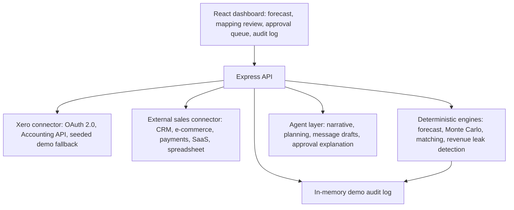

# CashPilot Architecture

## System Overview

CashPilot has four layers:

## Data Flow

1. The dashboard calls `GET /api/dashboard?source=xero`.
2. The backend loads either live Xero data or the seeded Xero demo snapshot.
3. Xero records are normalised into contacts, invoices, bills, payments, line items, reports, and recurring cash flows.
4. External sales records are loaded from the mock CRM/e-commerce connector.
5. Smart Mapping compares external customer names and email domains against Xero contacts.
6. Revenue Leak Detector checks whether closed-won external deals already have matching Xero invoices.
7. Forecast Engine builds a baseline cash forecast and an after-actions forecast.
8. Recommendation engines produce cash actions, revenue actions, productivity automations, and adaptive integration candidates.
9. The UI renders evidence and lets the owner approve selected recommendations.
10. `POST /api/actions/approve` records audit entries with source record IDs.

## Core Modules

- `src/integrations/xero.ts`: OAuth, Xero SDK setup, endpoint provenance, and live Accounting API reads.
- `src/data/demoSnapshot.ts`: seeded Xero-style company data used when live auth is unavailable.
- `src/connectors/mockExternalSales.ts`: CRM and e-commerce records used to demonstrate adaptive integration.
- `src/mapping/smartMappingService.ts`: name normalisation, confidence scoring, and evidence generation.
- `src/revenue/opportunityEngine.ts`: revenue leak and growth opportunity detection.
- `src/forecast/forecastEngine.ts`: daily ledger forecast, payment-delay assumptions, Monte Carlo risk, and action ranking.
- `src/productivity/automationEngine.ts`: productivity workflow recommendations.
- `src/integrations/adaptive/adaptiveIntegrationEngine.ts`: adaptive cross-system sync candidates.
- `src/audit/auditService.ts`: approval and source-record traceability for the demo.
- `src/App.tsx`: React dashboard, mapping review, approval queue, forecast visuals, and audit log.

## Why Xero Is Central

Xero is not a decorative data source. It is the source of truth used to:

- verify which customers and suppliers exist
- check invoice and bill status
- infer payment reliability
- build cash inflow and outflow forecasts
- validate whether external revenue has already been invoiced
- ground every recommendation in accounting records
- provide the approval plan for future writeback

The external connectors create possible opportunities. Xero confirms whether they are real, already handled, or risky.

## Temporary Demo Choices

The hackathon build uses an in-memory audit log and a mock external sales connector. These are deliberate shortcuts so the demo remains reliable without a production database or external CRM account.

Production hardening would add:

- persistent multi-tenant database
- encrypted token storage
- background sync jobs
- real CRM/e-commerce connectors
- Xero draft-invoice and contact-note writeback after owner approval
- Make scenarios for cross-app execution
- Lovable-hosted product UI once final design is locked
